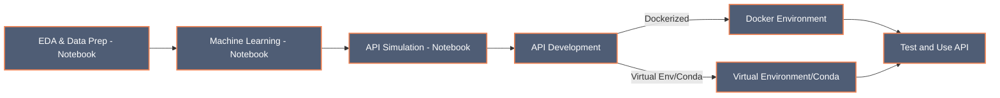

# `Monthly` & `Daily` Energy Forecasting `Docker API` ⚡

## 📘 Introduction

This project is all about predicting energy use 🔌. It began with a simple CSV file 📁, and I worked through steps like analyzing the data (EDA), using machine learning for predictions 🤖, and finally creating a Dockerized API 🐳. **This journey represents a common task for Machine Learning Engineers**: transforming data analysis into a usable API. I developed two prediction models: one for the next day 📆 and another for the next 30 days 🗓️, both based on historical data.

## 🎯 Objectives

Here's what I aimed to achieve:

- Understand and Prepare a raw CSV dataset 📁.
- Build models to forecast energy use for the upcoming **day** and **month** 🔮.
- Package these models into an API, making it straightforward for others to use, encapsulated in Docker 📦.

## Preparation Before Building the API 🛠️

I organized my work into Jupyter notebooks 📓, located in the `notebooks` directory. These notebooks detail my approach:

- **[EDA & Data Preparation - Energy_Forecasting.ipynb](./notebooks/EDA%20&%20Data%20Preparation%20-%20Energy_Forecasting.ipynb)**: Dives into the dataset and prepares it for the modeling stage 🕵️‍♂️.
  
- **[Machine Learning - Energy_Forecasting.ipynb](./notebooks/Machine%20Learning%20-%20Energy_Forecasting.ipynb)**: Develops and evaluates the prediction models 🏗️.
  
- **[API - Energy_Forecasting.ipynb](./notebooks/API%20-%20Energy_Forecasting.ipynb)**: Designs a system to simulate an API for energy use predictions 🌐.


### 🧜‍♂️ Development Workflow

Below is a **Mermaid Diagram** outlining the Development Workflow.


## 🏗️ API Construction

After prototyping in the [API - Energy_Forecasting Notebook](./notebooks/API%20-%20Energy_Forecasting.ipynb), Here is how i designed the project structure:

```
Energy-Forecast-API/
│
├── docker/                                 # Docker configuration files
│   ├── Dockerfile                          # Instructions for building the Docker image
│   └── requirements.txt                    # API dependencies for the Docker image
│
├── src/                                    # Source code for the API
│   ├── __init__.py                         
│   ├── energy_forecasting.py               # Main script for energy forecasting logic
│   └── models/                             
│       ├── __init__.py                     
│       ├── base_energy_model.py            # Base class for energy models
│       ├── short_term_energy_model.py      # Short-term energy forecasting model
│       └── long_term_energy_model.py       # Long-term energy forecasting model
│
├── notebooks/                              
│   ├── EDA_Data_Preparation.ipynb          # Exploratory Data Analysis and Data Preparation
│   ├── ML_Experimentation.ipynb            # Machine Learning model experimentation
│   └── API_Design.ipynb                    # Development of class-based API in notebook form
│
├── data/                                   
│   ├── raw/                                # Unprocessed initial data
│   └── processed/                          # Processed data ready for analysis
│
├── results/                                # Outputs from analysis and model training notebooks
│
├── .env                                    # Environment variables for Docker and the application
├── Makefile                                # Make commands for easy project setup and management
├── requirements.txt                        # Project dependencies for development
├── .gitignore                              # Specifies intentionally untracked files to ignore
└── README.md                               # Comprehensive guide to setup and use the API
```

## 🚀 Run the Code

You're a few steps away from predicting energy usage! Choose one of the two setups based on your preference:

### Option 1: Virtual Environment or Conda 🌿

If you like the Python environment approach, here's how to proceed:

1. **Environment Setup**: Confirm Python is up and ready, and set up your virtual environment or Conda.

2. **Dependency Installation**: In the project's main folder, run:
   ```sh
   pip install -r requirements.txt
   ```
   This installs all required libraries specified in `requirements.txt`.

3. **Environment Activation**: With dependencies in place, activate your environment to proceed.

4. **Running the Application**: Your environment is now primed for action.

   To get a short-term energy prediction, enter:
   ```sh
   make test-short-term
   ```
   You'll get a forecast like this:
   ```
   Short-term prediction for '2010-05-17': 1512.24
   ```

   For custom date predictions, use:
   ```sh
   make long-term DATE=2010-05-17
   ```
   And expect a response similar to:
   ```
   Long-term prediction for 2010-05-17: 1509.71
   ```
_For more commands, type `make help` in the terminal._

### Option 2: Docker 🐳

For Docker fans, make sure Docker is operational on your machine. You can containerize the app with ease.

- **Build Docker Image**:
  ```sh
  make docker-build
  ```
  Construct your Docker image before running forecasts.

- **Run Short-Term Forecast in Docker**:
  ```sh
  make test-docker-run
  ```
  See a prediction output like:
  ```
  Short-term prediction for 2010-05-17: 1513.30
  ```

- **Run Custom Forecast in Docker**:
  ```sh
  make docker-run DATE=2010-05-17 MODEL=long
  ```
  Get a custom forecast, for example:
  ```
  Long-term prediction for 2010-05-17: 1514.91
  ```
_For additional Docker commands, use `make help` in the terminal._

## 🌐 Let's Connect!

You can connect with me on **LinkedIn** or check out my **GitHub repositories**:

<div align="center">
  <a href="https://www.linkedin.com/in/labrijisaad/">
    
  </a>
  <a href="https://github.com/labrijisaad">
    
  </a>
</div>
